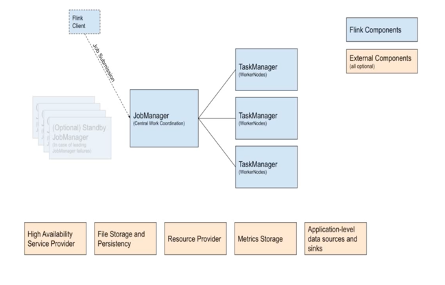

# Architecture

## Flink client
- compiles batch or streaming application into a dataflow graph, which it then submits to the `JobManager`.

## JobManager
- Is the name of the central work coordinator component of the Flink. it has implementations for different resources providers, which deffer on high-availability, resource allocation behavior and supported job submission modes.
  - Application mode
  - Per Job Mode
  - Session Mode

## Task Manager
- Are the services actually performing the work of a Fink Job.