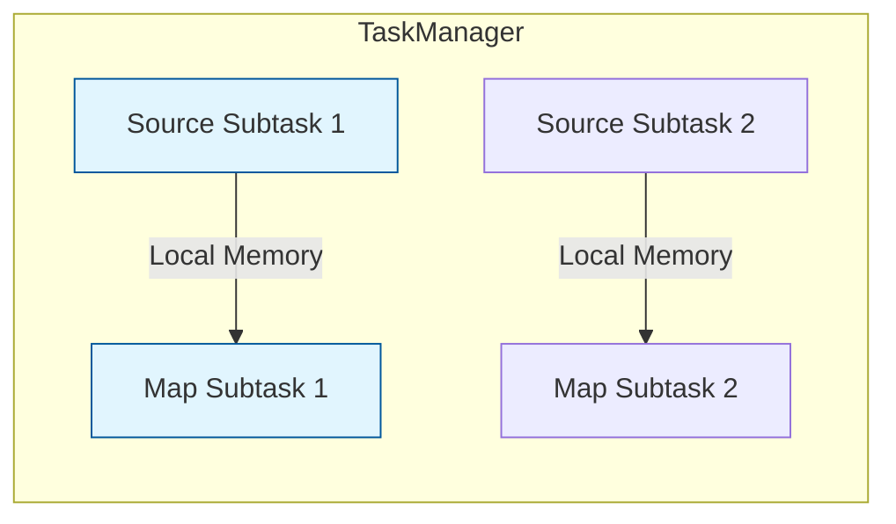
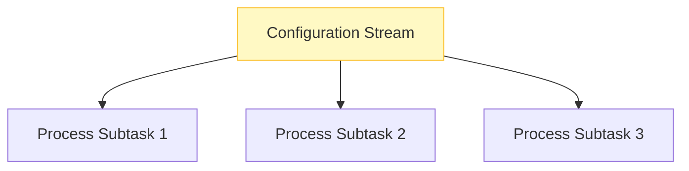
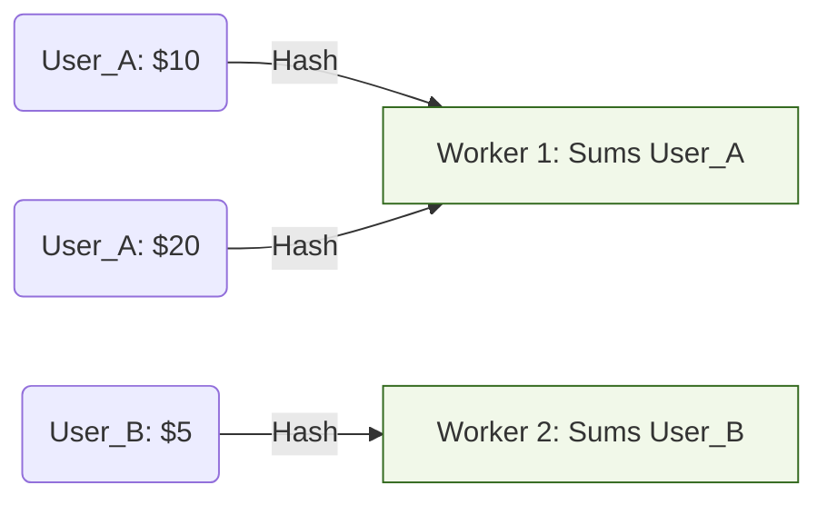
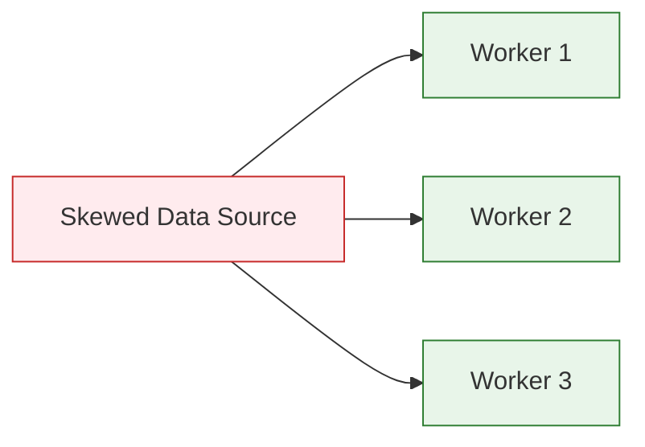
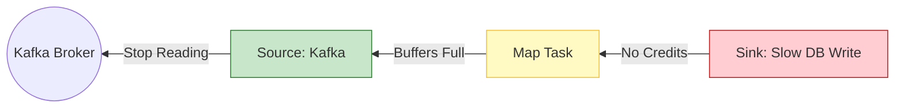

# 🚀 Flink Data Exchange Strategies: The Complete Guide

In Apache Flink, distributed processing efficiency depends heavily on how data is moved between tasks (operators). These strategies, also known as **Ship Strategies**, define the routing of records from a **Producer** subtask to a **Consumer** subtask.

---

## 1. Forward Strategy

The simplest and most performant strategy. Data is sent directly from a producer subtask to the corresponding consumer subtask in the next stage.

### How it works

* **Scope:** Occurs between operators with the same parallelism.
* **Optimization:** If operators are scheduled in the same *TaskManager*, data exchange happens via memory, bypassing the network stack entirely (**Operator Chaining**).



* **Real-World Use Case:** Simple transformations like `map()`, `filter()`, or `flatmap()`. For example, parsing raw JSON logs into Java Objects before any heavy aggregation occurs.

---

## 2. Broadcast Strategy

Every single record from the input stream is replicated and sent to **all** parallel instances of the downstream operator.

### How it works

* **Cost:** High network and memory overhead, as data is duplicated  times (where  is the parallelism).
* **Requirement:** Used when a task needs a "global view" of a dataset.



* **Real-World Use Case:** **Dynamic Rule Updates.** Imagine an e-commerce platform with a stream of millions of transactions and a small stream of "Fraud Rules" that change hourly. You broadcast the rules so every worker can validate local transactions against the entire active rule set.

---

## 3. Key-Based Strategy (Hash Partitioning)

Data is logically partitioned based on a "key" attribute defined by the user (using `keyBy`).

### How it works

* **Mechanism:** Flink applies a hash function to the key: .
* **Guarantee:** All records with the same key are guaranteed to land on the same subtask. This is essential for maintaining **keyed state**.



* **Real-World Use Case:** **Real-time Banking Balances.** To calculate a user's current balance, every transaction for "User 123" must go to the same worker so that the state (the running total) is updated consistently.

---

## 4. Random / Rebalance Strategy

Data is distributed uniformly across all downstream subtasks using a Round-Robin approach.

### How it works

* **Objective:** Load Balancing.
* **Solution:** This is the primary weapon against **Data Skew** (when one key has significantly more data than others, overloading a single worker).



* **Real-World Use Case:** **CDN Log Ingestion.** If a specific CDN edge server is under a DDoS attack, it will send vastly more logs than others. Using `.rebalance()` before a heavy processing step ensures the load of that spike is shared across the entire cluster, rather than crushing the one worker assigned to that server's ID.

---

## 📊 Performance Comparison

| Strategy      | Network Overhead        | Key-Order Preserved | Scales with Parallelism |
|---------------|-------------------------|---------------------|-------------------------|
| **Forward**   | Minimal (Zero if local) | Yes                 | Yes                     |
| **Broadcast** | Very High               | N/A                 | Limited by Memory       |
| **Key-Based** | Medium (Shuffle)        | Yes (per key)       | Yes                     |
| **Rebalance** | Medium (Shuffle)        | No                  | Excellent               |

---

### Implementation Snippet (Java)

```java
DataStream<String> stream = env.addSource(...);

// 1. Forward (Default for map)
stream.map(new MyMapFunction());

// 2. Broadcast
stream.broadcast(ruleStateDescriptor);

// 3. Key-Based
stream.keyBy(value -> value.getUserId());

// 4. Rebalance
stream.rebalance().map(new HeavyComputation());

```

---

## Backpressure in Flink

Backpressure is Flink’s built-in "braking system." It ensures that a fast producer doesn't drown a slow consumer in data, which would eventually lead to **OutOfMemoryErrors** or system crashes.

Here is a deep dive into how Backpressure integrates with the data exchange strategies we discussed.

---

## 🛡️ The Backpressure Mechanism

Flink uses a **Credit-Based Flow Control** at the network layer. Think of it as a "reservation system" for data packets.

### 1. The Credit System

* **The Consumer** tells the **Producer**: "I have space for 3 buffers (credits)."
* **The Producer** only sends data if it has credits.
* Once the Producer uses all credits, it **stops sending** and waits.

### 2. The Ripple Effect (Propagation)

Backpressure is not just between two tasks; it propagates backwards through the entire pipeline:

1. **Downstream** (Consumer) is slow (e.g., writing to a slow Database).
2. **Network Buffers** on the Consumer side fill up.
3. **Credits** stop being sent to the Producer.
4. **Producer Buffers** fill up because they can't ship data.
5. **Upstream** (Source) eventually throttles its ingestion rate (e.g., stops reading from Kafka).

---

## 🚦 Backpressure Across Strategies

The impact of backpressure varies depending on how you are moving the data:

### Forward Strategy

* **Behavior:** Very efficient. Since these are often "chained" in the same thread, backpressure is almost instantaneous. If the `Map` function is slow, the `Source` simply cannot call the next function in the chain.
* **Risk:** Low, as there is minimal "buffer bloat" between tasks.

### Key-Based (Hash) Strategy

* **Behavior:** This is where **Data Skew** creates "Selective Backpressure."
* **Scenario:** If `Key_A` is massive and `Key_B` is small, the subtask handling `Key_A` will trigger backpressure.
* **The Trap:** Because the Producer shares the same network connection to send multiple keys, a single slow key can **block the entire subtask**, even for keys that are not slow.

### Broadcast Strategy

* **Behavior:** The most dangerous for backpressure.
* **Scenario:** If even **one** of the parallel consumers is slow, it will eventually push back on the Producer. Since the Producer is sending the same data to everyone, the entire pipeline slows down to the speed of the **slowest** node in the cluster.

### Rebalance (Random) Strategy

* **Behavior:** The best "cure" for backpressure caused by skew.
* **Scenario:** If you notice one subtask is consistently under backpressure while others are idle, `rebalance()` redistributes the load. It turns a "local bottleneck" into "distributed work," often resolving the backpressure entirely.

---

## 🔍 How to Identify Backpressure

In the Flink Web UI, you can monitor the **Backpressure Tab**. It uses a color-coded system based on the ratio of time a task spends waiting for buffers:

| Status | Ratio | Meaning |
| --- | --- | --- |
| **OK (Green)** | 0.0 - 0.1 | The task is processing data comfortably. |
| **Low (Yellow)** | 0.1 - 0.5 | The task is starting to struggle to keep up. |
| **High (Red)** | 0.5 - 1.0 | The task is a bottleneck; upstream tasks are being throttled. |



---

## 🛠 Real-World Strategy: The "Checkpointing" Connection

When backpressure is high, **Checkpoints** (Flink's snapshots for fault tolerance) usually take much longer or fail. This is because "Checkpoint Barriers" travel in the same data stream as your records. If the buffers are jammed with data, the barriers can't move through the pipeline.

**Pro-Tip:** If your checkpoints are failing, look for the **Red** task in the Backpressure monitor first!

**Would you like me to show you how to tune the `taskmanager.network.memory.buffer-timeout` to balance between low latency and high-throughput backpressure handling?**
