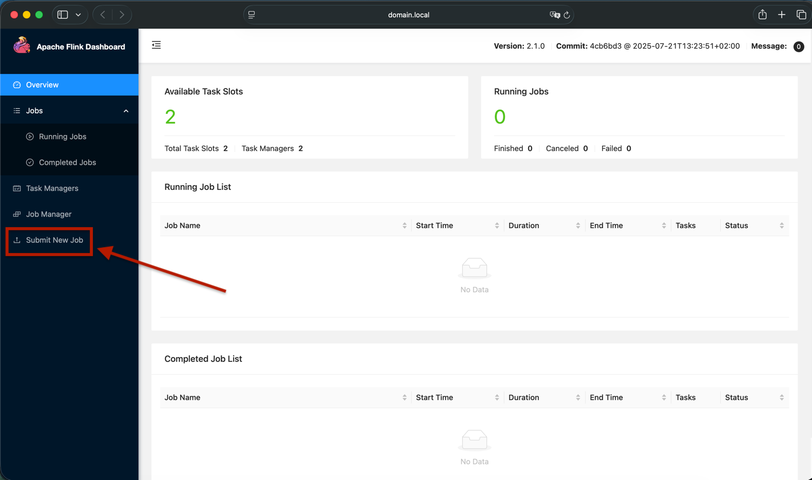
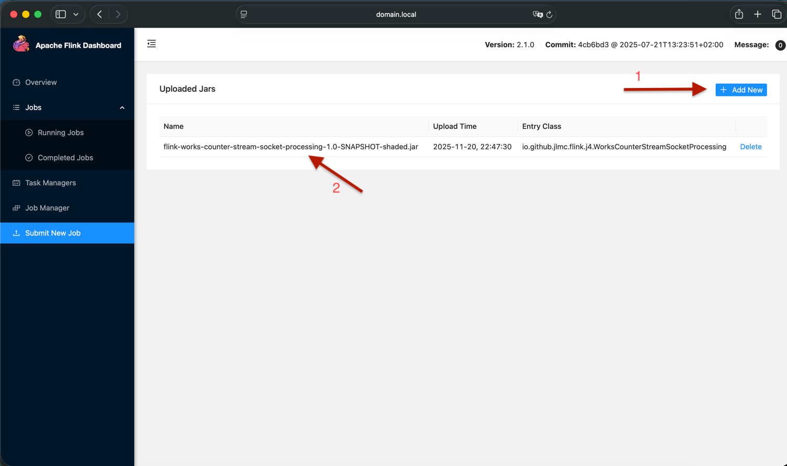
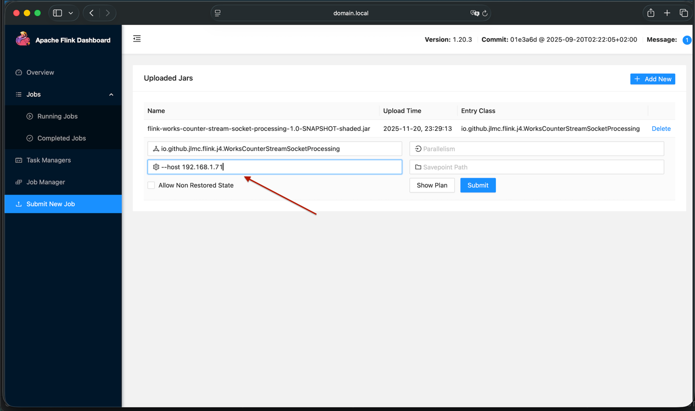
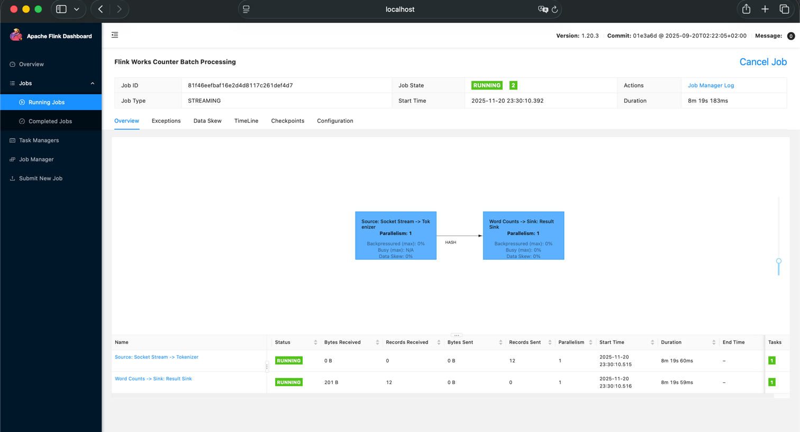

# Submit Flink Job to Flink Standalone Cluster(WebUI & Command)

This guide explains how to submit a Flink job to a Flink standalone cluster using either the Web UI or the CLI.

> Note: Make sure the Flink version used in your job matches the version supported by your Flink cluster.
In this guide, we use Flink 1.20.3, which runs on Java 17 in the official Docker container.
Your source code must therefore be compiled with Java 17.

## Package the application

- Firsts we have to package our application into a single jar file. For this demonstration we are going to use the example over the `projects/flink-works-counter-stream-socket-processing`.

From the project root:
```bash
ls
#pom.xml   projects/
```

### Build commands
Build only the module and its dependencies:

```bash
mvn -pl projects/flink-works-counter-stream-socket-processing -am package
```

Explanation
 - `-pl` = project list → selects the module(s) to build
 - `-am` = also make required dependencies (only if needed)
 - This will run package only for: `projects/flink-works-counter-stream-socket-processing` and will build any module it depends on (none, in your case).

 - Build only that module without building its dependencies: 
   - `mvn -pl projects/flink-works-counter-stream-socket-processing -am=false package`
   - or equivalent:
   - `mvn -pl projects/flink-works-counter-stream-socket-processing -Dskip.dependency=true package

Alternative:
- You can also reference the module by artifactId:
    ```bash
  mvn -pl :flink-works-counter-stream-socket-processing -am package
  ```
- This works even if the module path is deep.


### configuring the input source

For this example, the source is a socket on port 9999. You can create a test socket using:
```bash
nc -lk 9999
```


## Start up the flink manager

```bash
DOCKER_DEFAULT_PLATFORM=linux/amd64 docker compose -f docs/instalation/docker-official-flink-images/docker-compose.yaml up -d
```
- This ensures the cluster runs AMD64 images correctly on Apple Silicon.

### using the flink manager UI 

1. Open the Flink Web UI in a browser:

   - [localhost:8081](http://localhost:8081)
   - or any other for your infrastructure
   - [domain.local](http://domain.local:8081)

    

2. Upload the shaded JAR:
    `projects/flink-works-counter-stream-socket-processing/target/flink-works-counter-stream-socket-processing-1.0-SNAPSHOT-shaded.jar`

    
    
3. click into the row of the add jar, this will allow us to configure the flink job arguments.
    - `host`: flink.local, the host where the socket has been open.
    - `port`: 9999, the port that has been used for open the socket.
    - `the main class`: io.github.jlmc.flink.j4.WorksCounterStreamSocketProcessing
    - `--host domain.local --port 9999`
    - Note: Replace flink.local with the host where the socket is running.

    
4. To see the output:
   - Click on the last node of the Flink job graph
   - Open the Stdout tab
     - 
   - ⚠ If the cluster runs in Docker or Kubernetes, the Stdout tab may display:
     - `The file STDOUT does not exist on the TaskExecutor.If you are using kubernetes mode, please use "kubectl logs <pod-name>" to get stdout content.`. 
   - In that case as alternative, you may for example chek the logs of the container, by using the docker command bellow.
     ```bash
     docker ps
                                                                                    
     #CONTAINER ID   IMAGE                                   COMMAND                  CREATED          STATUS          PORTS                                         NAMES
     #d9332ef79412   apache/flink:1.20.3-scala_2.12-java17   "/docker-entrypoint.…"   24 minutes ago   Up 24 minutes   6123/tcp, 8081/tcp                            taskmanager-2
     #5eafd9f7c94b   apache/flink:1.20.3-scala_2.12-java17   "/docker-entrypoint.…"   24 minutes ago   Up 24 minutes   6123/tcp, 8081/tcp                            taskmanager-1
     #51aff4984505   apache/flink:1.20.3-scala_2.12-java17   "/docker-entrypoint.…"   24 minutes ago   Up 24 minutes   0.0.0.0:8081->8081/tcp, [::]:8081->8081/tcp   jobmanager-master

     docker logs -f taskmanager-1
     ```
     
---

## Submit the Job Using the CLI

Example command:
```bash
flink run -m localhost:8081 \
  -c io.github.jlmc.flink.j4.WorksCounterStreamSocketProcessing \
  target/flink-works-counter-stream-socket-processing-1.0-SNAPSHOT-shaded.jar \
  --host flink.local \
  --port 9999
```
Explanation:

  - `-m` localhost:8081 → JobManager address
  - `-c` → fully-qualified main class
  - `--host` / `--port` → parameters for your job

### Viewing Logs
1. Docker Compose:
    ```bash
    docker logs -f taskmanager-1
    ```

2. Kubernetes:
    ```bash
    kubectl logs -f <taskmanager-pod-name>
    ```
    - Local standalone:
      - Logs are located in `$FLINK_HOME/log/`

3. Copy your JAR into the JobManager container
Assuming your shaded JAR is: `projects/flink-works-counter-stream-socket-processing/target/flink-works-counter-stream-socket-processing-1.0-SNAPSHOT-shaded.jar`

    - Run:
    ```bash
     docker cp \
      projects/flink-works-counter-stream-socket-processing/target/flink-works-counter-stream-socket-processing-1.0-SNAPSHOT-shaded.jar \
      jobmanager-master:/opt/flink/usrlib/
      ```
    
    - `/opt/flink/usrlib/` is the recommended folder for user JARs in Flink Docker images.

4. Open a shell inside the JobManager container:
    ```bash
    docker exec -it jobmanager-master /bin/bash
    ```
    Now you are inside the container and can run flink commands.

5. Run the flink job
    ``` bash
   flink run -c io.github.jlmc.flink.j4.WorksCounterStreamSocketProcessing \
   /opt/flink/usrlib/flink-works-counter-stream-socket-processing-1.0-SNAPSHOT-shaded.jar \
   --host flink.local \
   --port 9999
    ```
   `-c` → fully qualified main class
   `/opt/flink/usrlib/`... → path to your shaded JAR inside container
   `--host` / --port → parameters for your job

6. Verify the job
   - Open the Flink Web UI at http://localhost:8081
   - Your job should appear in the Running Jobs list
   - To view logs from the TaskManager:
    ```bash
    docker logs -f taskmanager-1
    ```
   - Flink UI Stdout tab may not show logs inside Docker; always check container logs.
   


## Notes & Tips
- Make sure your job JAR matches the Flink version in the cluster.
- Use ParameterTool in your code to parse CLI arguments (--host, --port).
- On Apple Silicon, always set DOCKER_DEFAULT_PLATFORM=linux/amd64 when using official Flink Docker images.
- The Stdout tab in the Web UI will not show logs for containerized clusters; always check container logs.