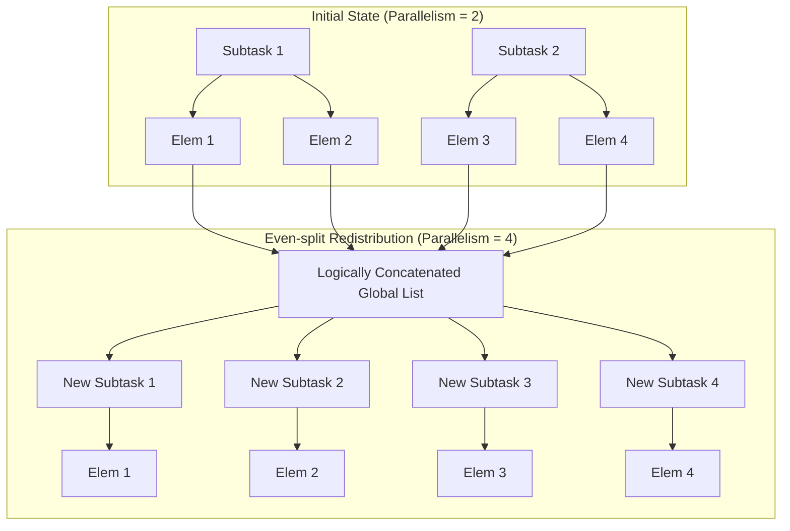
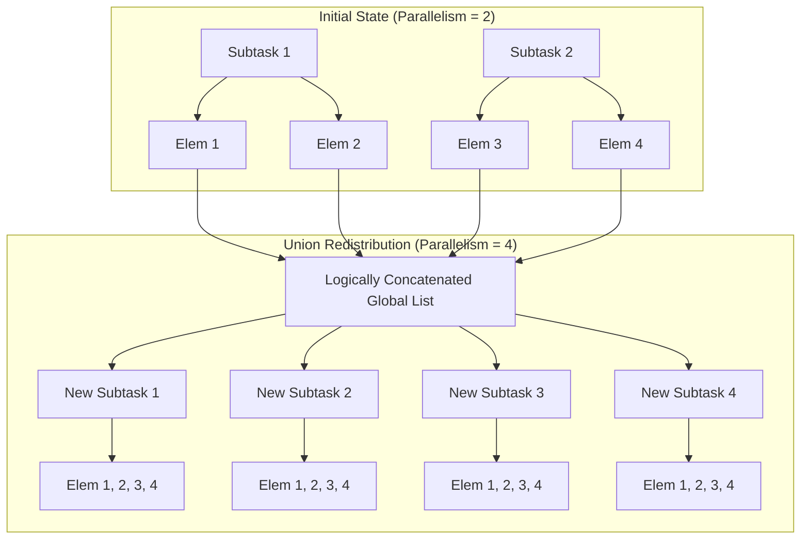

# Operator State in Apache Flink (Deep Dive)

Operator State (or non-keyed state) is a type of state in Flink that is bound to a single parallel operator instance. Unlike Keyed State, which is partitioned by keys, Operator State is partitioned by parallel subtasks.

## 1. Core Concepts

### Managed vs. Raw State
- **Managed State**: Handled by Flink's runtime. It uses data structures like `ListState`. Flink manages the serialization and redistribution automatically. **This example uses Managed State.**
- **Raw State**: Handled by the operator itself. Flink only sees a sequence of bytes and doesn't know the internal structure. It is much harder to implement correctly.

### CheckpointedFunction Interface
To use Managed Operator State, your function must implement `CheckpointedFunction`. This interface provides two essential hooks:

1. `void snapshotState(FunctionSnapshotContext context)`:
   - Called whenever a checkpoint is triggered.
   - Purpose: Synchronize your in-memory data (e.g., a local `List`) into the Flink-managed `ListState`.
   - Flink ensures that the state is persisted to the configured State Backend (e.g., Hashmap or RocksDB).

2. `void initializeState(FunctionInitializationContext context)`:
   - Called when the operator starts (new job or recovery).
   - Purpose: Define your state descriptors and retrieve the state handles from the `OperatorStateStore`.
   - If `context.isRestored()` is true, you must read from the state handles to populate your local variables.

---

## 2. Redistribution Schemes

When the parallelism of an operator changes (Scaling Up/Down), Flink needs to redistribute the existing state elements among the new set of subtasks. Currently, only **list-style** redistribution is supported.

### A. Even-split Redistribution (`getListState`)
The total state is logically a concatenation of all lists from all subtasks. On recovery, the elements are distributed one-by-one in a round-robin or equal-sized manner.

- **Use Case**: Buffered data for sinks, Kafka partition offsets.
- **Visual logic**:

### B. Union Redistribution (`getUnionListState`)
On recovery, **every** subtask receives the **complete** concatenated list of all state elements.

- **Use Case**: When every instance needs global knowledge of what was processed before (e.g., a list of all source files processed).
- **Warning**: High cardinality (many elements) will lead to OOM (Out of Memory) because the full list is duplicated in every subtask.
- **Visual logic**:

---

## 3. Comparison Table

| Feature | Keyed State | Operator State | Broadcast State |
| :--- | :--- | :--- | :--- |
| **Scope** | Per Key | Per Parallel Instance | Global (Broadcasted) |
| **Data Structure** | Value, List, Map, etc. | List (only) | Map |
| **Redistribution** | By Key Group | Even-split or Union | Copy to all |
| **Complexity** | Low (managed by Flink) | Moderate (manual sync) | Moderate |
| **Typical Use** | Aggregations, Windowing | Source/Sink Offsets | Dynamic Configs |

---

## 4. Best Practices for Flink 1.20

1. **Set Operator UUIDs (`.uid("...")`)**:
   Always set a unique ID for stateful operators. If you don't, Flink generates one based on the job graph. If you change the graph later, the generated ID changes, and Flink won't be able to map the old state to the new operator.
2. **Handle Cardinality**:
   Avoid `UnionListState` if the list can grow indefinitely. Use it only for small metadata.
3. **Synchronization**:
   Remember that `snapshotState` and `initializeState` are the only places to interact with the managed state handles. The `map` (or `processElement`) function should only interact with local (transient) variables for performance.
4. **Serialization**:
   Ensure the objects in your `List` are properly serializable by Flink (using POJOs or Flink TypeInformation).

## 5. References
- [Official Flink 1.20 Documentation - State Management](https://nightlies.apache.org/flink/flink-docs-release-1.20/docs/dev/datastream/fault-tolerance/state/)
- [Flink Checkpointing Mechanics](https://nightlies.apache.org/flink/flink-docs-release-1.20/docs/dev/datastream/fault-tolerance/checkpointing/)
- [Redistribution Patterns](https://nightlies.apache.org/flink/flink-docs-stable/docs/dev/datastream/fault-tolerance/state_v2/#redistribution-schemes)
