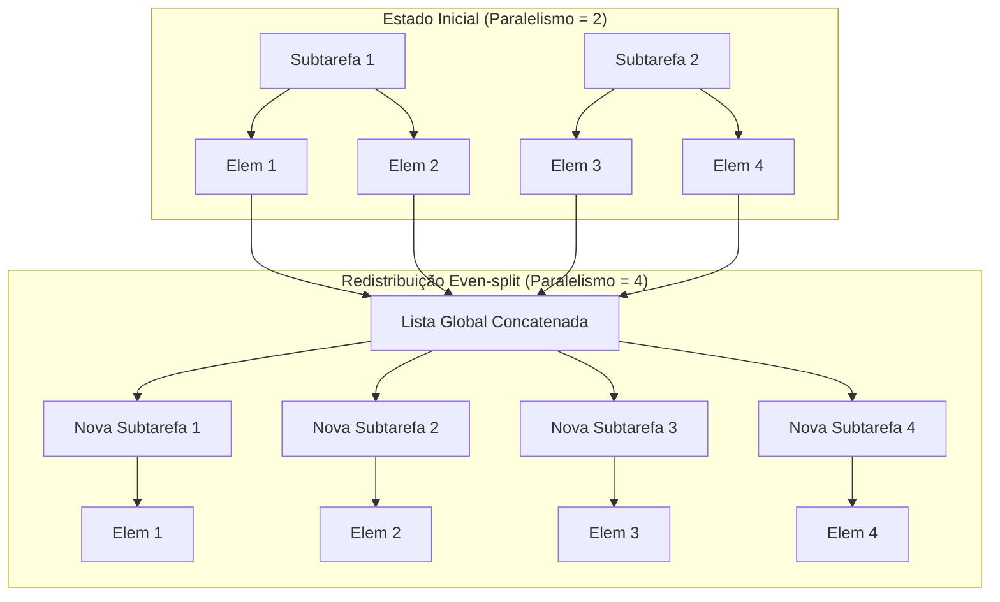
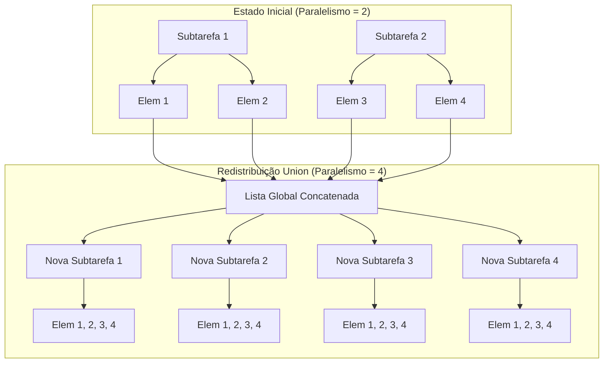

# Operator State no Apache Flink (Exploração Detalhada)

O Operator State (ou estado não chaveado) é um tipo de estado no Flink que está ligado a uma única instância paralela de um operador. Ao contrário do Keyed State, que é particionado por chaves, o Operator State é particionado por subtarefas paralelas.

## 1. Conceitos Fundamentais

### Estado Gerido (Managed) vs. Estado Bruto (Raw)
- **Estado Gerido (Managed State)**: Controlado pelo runtime do Flink. Utiliza estruturas de dados como `ListState`. O Flink gere a serialização e a redistribuição automaticamente. **Este exemplo utiliza Estado Gerido.**
- **Estado Bruto (Raw State)**: Controlado pelo próprio operador. O Flink apenas vê uma sequência de bytes e não conhece a estrutura interna. É muito mais difícil de implementar corretamente.

### Interface CheckpointedFunction
Para utilizar o Estado Gerido do Operador, a sua função deve implementar a interface `CheckpointedFunction`. Esta interface fornece dois ganchos (hooks) essenciais:

1. `void snapshotState(FunctionSnapshotContext context)`:
   - Invocado sempre que um checkpoint é acionado.
   - **Objetivo**: Sincronizar os seus dados em memória (ex: uma `List` local) com o `ListState` gerido pelo Flink.
   - O Flink garante que o estado é persistido no State Backend configurado (ex: Hashmap ou RocksDB).

2. `void initializeState(FunctionInitializationContext context)`:
   - Invocado quando o operador arranca (novo trabalho ou recuperação).
   - **Objetivo**: Definir os descritores de estado e obter os manípulos (handles) de estado do `OperatorStateStore`.
   - Se `context.isRestored()` for verdadeiro, deve ler os manípulos de estado para preencher as suas variáveis locais.

---

## 2. Esquemas de Redistribuição

Quando o paralelismo de um operador é alterado (Aumento/Redução de Escala), o Flink precisa de redistribuir os elementos de estado existentes entre o novo conjunto de subtarefas. Atualmente, apenas a redistribuição em **estilo de lista** é suportada.

### A. Redistribuição Even-split (Divisão Equitativa) (`getListState`)
O estado total é logicamente uma concatenação de todas as listas de todas as subtarefas. Na recuperação, os elementos são distribuídos um a um de forma rotativa (round-robin) ou em tamanhos iguais.

- **Caso de Uso**: Dados em buffer para sinks, offsets de partições Kafka.
- **Lógica Visual**:

### B. Redistribuição Union (União) (`getUnionListState`)
Na recuperação, **cada** subtarefa recebe a lista **completa** e concatenada de todos os elementos de estado.

- **Caso de Uso**: Quando cada instância necessita de conhecimento global do que foi processado anteriormente (ex: uma lista de todos os ficheiros de origem processados).
- **Aviso**: Alta cardinalidade (muitos elementos) levará a erros de falta de memória (OOM), pois a lista completa é duplicada em cada subtarefa.
- **Lógica Visual**:

---

## 3. Tabela Comparativa

| Funcionalidade | Keyed State | Operator State | Broadcast State |
| :--- | :--- | :--- | :--- |
| **Escopo** | Por Chave | Por Instância Paralela | Global (Broadcasted) |
| **Estrutura de Dados** | Value, List, Map, etc. | List (apenas) | Map |
| **Redistribuição** | Por Key Group | Even-split ou Union | Cópia para todos |
| **Complexidade** | Baixa (gerido pelo Flink) | Moderada (sinc. manual) | Moderada |
| **Uso Típico** | Agregações, Janelas | Offsets de Source/Sink | Configs Dinâmicas |

---

## 4. Boas Práticas para o Flink 1.20

1. **Definir UUIDs dos Operadores (`.uid("...")`)**:
   Defina sempre um ID único para operadores com estado. Se não o fizer, o Flink gera um com base no grafo do trabalho. Se alterar o grafo mais tarde, o ID gerado muda e o Flink não conseguirá mapear o estado antigo ao novo operador.
2. **Gerir a Cardinalidade**:
   Evite `UnionListState` se a lista puder crescer indefinidamente. Utilize-o apenas para metadados pequenos.
3. **Sincronização**:
   Lembre-se que `snapshotState` e `initializeState` são os únicos locais para interagir com os manípulos de estado geridos. A função `map` (ou `processElement`) deve apenas interagir com variáveis locais (transientes) por questões de performance.
4. **Serialização**:
   Garanta que os objetos na sua `List` são devidamente serializáveis pelo Flink (utilizando POJOs ou `TypeInformation` do Flink).

## 5. Referências
- [Documentação Oficial Flink 1.20 - State Management](https://nightlies.apache.org/flink/flink-docs-release-1.20/docs/dev/datastream/fault-tolerance/state/)
- [Mecânicas de Checkpointing do Flink](https://nightlies.apache.org/flink/flink-docs-release-1.20/docs/dev/datastream/fault-tolerance/checkpointing/)
- [Padrões de Redistribuição](https://nightlies.apache.org/flink/flink-docs-stable/docs/dev/datastream/fault-tolerance/state_v2/#redistribution-schemes)
