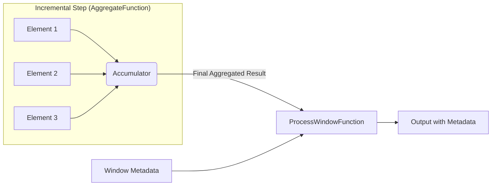

# Window Functions in Apache Flink

In Apache Flink, a `WindowedStream` represents a data stream where elements are grouped into finite "buckets" (windows) based on a `WindowAssigner`. Once you have a `WindowedStream`, you must apply a **Window Function** to define the computation that happens on the elements inside each bucket.

For more details, refer to the [Official Flink Documentation on Window Functions](https://nightlies.apache.org/flink/flink-docs-release-1.20/docs/dev/datastream/operators/windows/#window-functions).

## 1. Creating a WindowedStream

To get a `WindowedStream`, you generally apply `.keyBy()` to a standard `DataStream`, followed by a `.window()` assigner (e.g., Tumbling, Sliding, or Session windows):

```java
// Group by key, then bucket events into 10-minute tumbling windows
WindowedStream<SensorReading, String, TimeWindow> windowedStream = dataStream
    .keyBy(SensorReading::getId)
    .window(TumblingEventTimeWindows.of(Duration.ofMinutes(10)));
```

---

## 2. Types of Window Functions

Flink categorizes window functions into two main types depending on how they process the underlying data:
- **Incremental Aggregation**
- **Full Window Functions**

### A. Incremental Aggregation Functions

These functions evaluate elements eagerly as they arrive in the window. They are **highly memory-efficient** because Flink only keeps the rolling aggregated state (e.g., a single running sum) instead of buffering every raw record.

#### 1. Predefined Rolling Aggregations
High-level functions for common mathematical operations:
* **`sum()`**: Sums the values of a specific field.
* **`min()`** / **`max()`**: Keeps the minimum/maximum value of a field.
* **`minBy()`** / **`maxBy()`**: Returns the **entire element** that has the minimum/maximum value in the specified field.

#### 2. `ReduceFunction`
Combines elements sequentially. The input type, intermediate state type, and output type must all be identical.

```java
windowedStream.reduce(new ReduceFunction<SensorReading>() {
    @Override
    public SensorReading reduce(SensorReading r1, SensorReading r2) {
        return new SensorReading(r1.getId(), Math.max(r1.getTemperature(), r2.getTemperature()));
    }
});
```

#### 3. `AggregateFunction`
A more flexible version of `reduce`. It allows the input data type, the accumulator (intermediate state), and the final output type to be different.

```java
// AggregateFunction<Input, Accumulator, Output>
windowedStream.aggregate(new AggregateFunction<SensorReading, AverageAccumulator, Double>() {
    @Override
    public AverageAccumulator createAccumulator() { return new AverageAccumulator(); }

    @Override
    public AverageAccumulator add(SensorReading value, AverageAccumulator accum) {
        accum.sum += value.getTemperature();
        accum.count++;
        return accum;
    }

    @Override
    public Double getResult(AverageAccumulator accum) { return accum.sum / accum.count; }

    @Override
    public AverageAccumulator merge(AverageAccumulator a, AverageAccumulator b) {
        a.sum += b.sum;
        a.count += b.count;
        return a;
    }
});
```

### B. Full Window Functions

These functions buffer **all elements** belonging to a window in memory until the window triggers. Once triggered, the function is handed an `Iterable` containing all the records. While more memory-intensive, they provide metadata context like window start/end times and access to side outputs.

#### 1. `ProcessWindowFunction`
The most powerful window function. It provides access to a `Context` object for querying keys, time metrics, and state.

```java
windowedStream.process(new ProcessWindowFunction<SensorReading, Alert, String, TimeWindow>() {
    @Override
    public void process(String key, Context context, Iterable<SensorReading> elements, Collector<Alert> out) {
        long windowEnd = context.window().getEnd();
        long count = 0;
        for (SensorReading r : elements) { count++; }
        out.collect(new Alert(key, "Window ended at " + windowEnd + " with " + count + " elements"));
    }
});
```

#### 2. `WindowFunction` (Legacy)
An older API replaced by `ProcessWindowFunction`. It lacks advanced context features (like timers or state) and should be avoided in new code.

---

## 3. Best Practice: Combining Incremental & Full Functions

Because `ProcessWindowFunction` buffers everything, it can cause **Out-Of-Memory (OOM)** errors on high-throughput streams. To avoid this while still getting window metadata, you can combine an `IncrementalAggregation` with a `ProcessWindowFunction`.

The incremental function will aggregate elements as they arrive, and when the window triggers, only the **single aggregated result** is passed to the `ProcessWindowFunction`.

```java
// Incremental aggregation performance + Full window metadata context
DataStream<MinMaxResult> result = windowedStream.aggregate(
    new MyIncrementalMinMaxAggregate(), 
    new MyProcessWindowMetadataFunction()
);
```

### Data Flow Diagram



---

## 4. Handling Late Data (Side Outputs)

By default, late elements (arriving after the watermark) are dropped. You can capture these using **Side Outputs**.

```java
OutputTag<SensorReading> lateDataTag = new OutputTag<SensorReading>("late-readings"){};

SingleOutputStreamOperator<SensorReading> result = windowedStream
    .sideOutputLateData(lateDataTag)
    .process(new MyProcessWindowFunction());

// Retrieve the late data stream
DataStream<SensorReading> lateStream = result.getSideOutput(lateDataTag);
```

---

## Summary Table

| Function      | Type        | Memory Efficiency | Use Case                                          |
|:--------------|:------------|:------------------|:--------------------------------------------------|
| **Reduce**    | Incremental | High              | Simple math where types don't change.             |
| **Aggregate** | Incremental | High              | Complex logic where types change (e.g., Average). |
| **Process**   | Full        | Low               | Access to window metadata, timers, or state.      |
| **Combined**  | Hybrid      | High              | Metadata access WITHOUT buffering all elements.   |

---

## References
- [Apache Flink Official Docs - Windows](https://nightlies.apache.org/flink/flink-docs-release-1.20/docs/dev/datastream/operators/windows/)
- [Flink Forward - Windowing Deep Dive](https://www.ververica.com/blog/windowing-in-apache-flink-a-comprehensive-guide)
