# Out-of-orderness Timestamp (FHIR ADT)

This example demonstrates how to process Healthcare FHIR `ADT` events in Apache Flink using `event time`, when events arrive out of order in Kafka.

## Objective

- Show how to use `WatermarkStrategy.forBoundedOutOfOrderness(...)` to tolerate delay and temporal disorder.
- Ensure correct time-window aggregations based on `eventTimestamp` (business time), not arrival order.
- Demonstrate best practices with `withIdleness(...)` so inactive partitions do not block global watermark progress.

## Domain case it solves

In hospital integrations, ADT messages may arrive late or out of order due to network latency, retries, buffering, and differences between systems.

Without `event time` + `watermarks`, window-based calculations can become incorrect (for example, discharges and admissions assigned to the wrong window). This example solves that by:

- using the `eventTimestamp` embedded in each event;
- defining an out-of-orderness tolerance of `10s`;
- closing windows based on `event time` progress (watermark), instead of processing clock time.

## Data model

Input (`FhirAdtEvent`):

- `messageId`
- `patientId`
- `facilityId`
- `eventType` (`ADT_A01`, `ADT_A02`, `ADT_A03`)
- `eventTimestamp` (UTC)

Output (`AdtWindowResult`):

- `facilityId`
- `eventType`
- `totalEvents`
- subtotals: `admits` (`ADT_A01`), `transfers` (`ADT_A02`), `discharges` (`ADT_A03`)
- window `start` and `end`

## Pipeline

Implemented in `OutOfOrdernessTimestampKafkaExample`:

1. Consumes events from Kafka topic `fhir-adt-events`.
2. Assigns event timestamps and watermarks:
   - `forBoundedOutOfOrderness(Duration.ofSeconds(10))`
   - timestamp assigner: `event.eventTimestamp.toEpochMilli()`
   - `withIdleness(Duration.ofMinutes(1))`
3. Groups by key `facilityId|eventType`.
4. Applies `TumblingEventTimeWindows.of(Duration.ofSeconds(10))`.
5. Aggregates counts and publishes results to `fhir-adt-window-counts`.

### Diagram

```mermaid
flowchart LR
    A[ADT/FHIR Producers\nHospital systems] --> B[Kafka input\n`fhir-adt-events`]
    B --> C[Flink Source\nJSON -> `FhirAdtEvent`]
    C --> D[Timestamp assigner\n`eventTimestamp`]
    D --> E[WatermarkStrategy\nOut-of-orderness: 10s\nIdleness: 1m]
    E --> F["KeyBy('facilityId|eventType')"]
    F --> G[Event-time Tumbling Window\n10 seconds]
    G --> H[Aggregate + ProcessWindow\n`AdtWindowResult`]
    H --> I[Kafka output\n`fhir-adt-window-counts`]
```



## Out-of-order events example

The `submit-events.sh` script sends a sequence with 2 hospitals (`hospital-lisbon` and `hospital-huc`) and deliberately out-of-order timestamps (for example, an event at `10:00:05` may arrive after one at `10:00:19`).

This helps observe that:

- Flink uses event-time semantics to build windows;
- late events within the configured tolerance still go to the correct window;
- watermark trade-off applies: more tolerance increases confidence, but may increase output latency.

## How to run

From the module directory:

```bash
./build-jdk17.sh
./upload-job.sh
./submit-events.sh
```

To monitor results:

- logs with `WINDOW_RESULT` (application stdout);
- Kafka output topic `fhir-adt-window-counts`.

## Practical value

This case supports healthcare operational monitoring (occupancy, admissions/discharges/transfers throughput per hospital) with higher robustness against delayed and out-of-order data, preserving temporal correctness of indicators.
