# Out-of-orderness Timestamp (FHIR ADT)

Este exemplo demonstra como processar eventos Healthcare FHIR `ADT` em `event time` no Apache Flink, quando os eventos chegam fora de ordem no Kafka.

## Objetivo

- Mostrar a utilização de `WatermarkStrategy.forBoundedOutOfOrderness(...)` para tolerar atraso e desordem temporal.
- Garantir agregações corretas por janela temporal com base no `eventTimestamp` (tempo de negócio), e não na ordem de chegada.
- Demonstrar boas práticas com `withIdleness(...)` para evitar que partições inativas bloqueiem o progresso global do watermark.

## Domain case que resolve

Em integrações hospitalares, mensagens ADT podem chegar atrasadas ou fora de ordem devido a latência de rede, retries, buffering e diferenças entre sistemas.

Sem `event time` + `watermarks`, os cálculos por janela podem ficar incorretos (por exemplo, altas e admissões atribuídas à janela errada). Este exemplo resolve esse problema ao:

- usar `eventTimestamp` embebido em cada evento;
- definir tolerância de desordem de `10s`;
- fechar janelas por progresso de `event time` (watermark), em vez de relógio de processamento.

## Modelo de dados

Entrada (`FhirAdtEvent`):

- `messageId`
- `patientId`
- `facilityId`
- `eventType` (`ADT_A01`, `ADT_A02`, `ADT_A03`)
- `eventTimestamp` (UTC)

Saída (`AdtWindowResult`):

- `facilityId`
- `eventType`
- `totalEvents`
- subtotais: `admits` (`ADT_A01`), `transfers` (`ADT_A02`), `discharges` (`ADT_A03`)
- `start` e `end` da janela

## Pipeline

Implementado em `OutOfOrdernessTimestampKafkaExample`:

1. Consome eventos do tópico Kafka `fhir-adt-events`.
2. Atribui timestamps de evento e watermarks:
   - `forBoundedOutOfOrderness(Duration.ofSeconds(10))`
   - timestamp assigner: `event.eventTimestamp.toEpochMilli()`
   - `withIdleness(Duration.ofMinutes(1))`
3. Agrupa por chave `facilityId|eventType`.
4. Aplica `TumblingEventTimeWindows.of(Duration.ofSeconds(10))`.
5. Agrega contagens e publica resultados em `fhir-adt-window-counts`.

### Diagrama

```mermaid
flowchart LR
    A[Produtores ADT/FHIR\nSistemas hospitalares] --> B[Kafka input\n`fhir-adt-events`]
    B --> C[Flink Source\nJSON -> `FhirAdtEvent`]
    C --> D[Timestamp assigner\n`eventTimestamp`]
    D --> E[WatermarkStrategy\nOut-of-orderness: 10s\nIdleness: 1m]
    E --> F["KeyBy('facilityId|eventType')"]
    F --> G[Event-time Tumbling Window\n10 segundos]
    G --> H[Aggregate + ProcessWindow\n`AdtWindowResult`]
    H --> I[Kafka output\n`fhir-adt-window-counts`]
```



## Exemplo de eventos fora de ordem

O script `submit-events.sh` envia uma sequência com 2 hospitais (`hospital-lisbon` e `hospital-huc`) e timestamps deliberadamente fora de ordem (por exemplo, evento `10:00:05` pode chegar depois de `10:00:19`).

Isto permite observar que:

- o Flink usa a noção de tempo de evento para compor janelas;
- eventos atrasados dentro da tolerância ainda entram na janela correta;
- o trade-off watermark aplica-se: mais tolerância aumenta confiança, mas pode aumentar latência de emissão.

## Como executar

No diretório do módulo:

```bash
./build-jdk17.sh
./upload-job.sh
./submit-events.sh
```

Para acompanhar resultados:

- logs com `WINDOW_RESULT` (stdout da aplicação);
- tópico de saída Kafka `fhir-adt-window-counts`.

## Valor prático

Este caso suporta monitorização operacional em saúde (ocupação, throughput de admissões/altas/transferências por hospital) com maior robustez perante atrasos e desordem dos dados, preservando correção temporal dos indicadores.

## Exemplos adicionais por tópico (0-138)

O módulo inclui também classes focadas em `src/main/java/.../examples` para estudar cada tópico de forma isolada:

- `0. Base de event-time windowing (timestamps monotónicos)`
  - Classe: `Example0OutOfOrdernessAndLateDataExample`
  - Demonstra a configuração base com `forMonotonousTimestamps()` e porque esta abordagem só é adequada quando os eventos chegam estritamente ordenados.

- `1. Tratamento de out-of-orderness com atraso limitado`
  - Classe: `Example1HandleOutOfOrdernessAndLateData`
  - Demonstra `forBoundedOutOfOrderness(Duration.ofSeconds(2))` para incluir eventos ligeiramente fora de ordem na janela correta antes de serem considerados tardios.

- `129. WatermarkStrategy(TimestampAssigner&WatermarkGenerator)`
  - Classe: `Example2WatermarkStrategyWithAssignerAndGenerator`
  - Mostra construção explícita de `WatermarkStrategy` combinando:
    - extração de timestamp (`eventTime`);
    - gerador custom (`onEvent` + `onPeriodicEmit`).

- `130. Dived Into Flink Source Code In Depth Understand How Watermarks Work`
  - Classe: `Example3DiveIntoWatermarkLifecycle`
  - Explica o ciclo interno com os dois callbacks críticos:
    - `onEvent(...)`: atualiza estado local de progresso;
    - `onPeriodicEmit(...)`: publica watermark para operadores downstream.

- `131. How to Customize The Flink Watermark Generator by Periodic Approach`
  - Classe: `Example4CustomPeriodicWatermarkGenerator`
  - Demonstra estratégia periódica (`maxSeenTs - outOfOrderness - 1`) e o trade-off latência/completude.

- `132. How to Customize The Flink Watermark Generator by Punctuated Approach`
  - Classe: `Example5CustomPunctuatedWatermarkGenerator`
  - Demonstra abordagem pontuada: watermark emitido apenas em eventos marcador.

- `133. How Flink Watermark Propagation Works`
  - Classe: `Example6WatermarkPropagation`
  - Demonstra que o progresso downstream fica limitado pelo menor watermark upstream.

- `134. Flink Idle Source and How to Handle Idleness Source`
  - Classe: `Example7IdleSourceHandling`
  - Demonstra `withIdleness(...)` para impedir que partições/sources inativas bloqueiem o progresso global.

- `135. WindowedStream Allowed Lateness`
  - Classe: `Example8WindowAllowedLateness`
  - Demonstra `.allowedLateness(...)` para manter janelas abertas para atualizações tardias aceitáveis.

- `136. WindowedStream Side Output Late Event Avoid Data Lost`
  - Classe: `Example9SideOutputLateEvents`
  - Demonstra `.sideOutputLateData(...)` para capturar eventos muito tardios e evitar perda silenciosa.

- `137. Flink Two Window Join Operation and Practice`
  - Classe: `Example10TwoStreamWindowJoin`
  - Demonstra `window join` em event time entre dois streams.

- `138. Flink Two KeyedStreams Interval Join Operation and Practice`
  - Classe: `Example11TwoKeyedStreamsIntervalJoin`
  - Demonstra correlação temporal por intervalo (`between(-2s, +2s)`) entre `KeyedStream`s.
