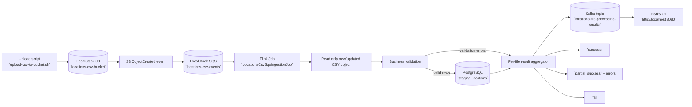

### Locations CSV with SQS-triggered S3 processing

This module processes CSV files uploaded to S3 (LocalStack) by consuming S3 object-created notifications through SQS.

### Solution diagram



### Pipeline steps (inputs and outputs)

1. **CSV upload to S3**
   - Input: local CSV file (for example `./input/locations-test.csv`)
   - Output: object stored in S3 bucket `locations-csv-bucket`
   - Classes/scripts: `scripts/upload-csv-to-bucket.sh`

2. **S3 notification to SQS**
   - Input: S3 `ObjectCreated` event
   - Output: message in SQS queue `locations-csv-events` with bucket/key reference
   - Classes/scripts: `scripts/init-aws.sh` (configuração do evento S3 -> SQS)

3. **Flink source consumes SQS events**
   - Input: SQS message with S3 object metadata
   - Output: stream of S3 object references to be processed
   - Classes: `io.github.jlmc.flink.locationscsv.source.S3CsvObjectsFromSqsSource`

4. **CSV read from S3 object**
   - Input: S3 object reference (bucket + key)
   - Output: stream of rows as `LocationWithSource` + end-of-file marker per file
   - Classes: `io.github.jlmc.flink.locationscsv.source.S3ObjectCsvReaderFlatMap`, `io.github.jlmc.flink.locationscsv.source.S3ObjectEvent`

5. **Business validation**
   - Input: `LocationWithSource` rows
   - Output:
     - valid rows to main stream
     - invalid rows to side output (`ValidationErrorWithSource`)
   - Classes: `io.github.jlmc.flink.locationscsv.application.validation.LocationWithSourceBusinessValidator`, `io.github.jlmc.flink.locationscsv.application.validation.LocationBusinessValidator`, `io.github.jlmc.flink.locationscsv.application.validation.GeoRangeValidator`, `io.github.jlmc.flink.locationscsv.application.validation.ImageUrlValidator`, `io.github.jlmc.flink.locationscsv.application.validation.UrlImageAccessibleValidator`

6. **Persist valid rows in PostgreSQL**
   - Input: valid rows (`LocationWithSource`)
   - Output: records inserted into table `staging_locations`
   - Classes: `org.apache.flink.connector.jdbc.core.datastream.sink.JdbcSink` (configurado em `io.github.jlmc.flink.locationscsv.LocationsCsvSqsIngestionJob`)

7. **Build per-file processing metrics**
   - Input:
     - valid row events
     - invalid row events
     - file completed marker
   - Output: unified metric stream (`FileProcessingMetric`) keyed by `sourceFilePath`
   - Classes: `io.github.jlmc.flink.locationscsv.domain.entity.FileProcessingMetric`

8. **Aggregate per-file result**
   - Input: keyed metrics per file (`FileProcessingMetric`)
   - Output: one `FileProcessingResult` per file with status (`success`, `partial_success`, `fail`) and errors
   - Classes: `io.github.jlmc.flink.locationscsv.application.processing.FileProcessingResultAggregator`, `io.github.jlmc.flink.locationscsv.domain.entity.FileProcessingResult`, `io.github.jlmc.flink.locationscsv.domain.entity.FileProcessingError`

9. **Publish result to Kafka**
   - Input: `FileProcessingResult`
   - Output: JSON message in Kafka topic `locations-file-processing-results`
   - Classes: `org.apache.flink.connector.kafka.sink.KafkaSink`, `io.github.jlmc.flink.locationscsv.LocationsCsvSqsIngestionJob.FileProcessingResultJsonSerializer`

10. **Operational visibility**
    - Input: Kafka topic messages + application logs
    - Output: result inspection in Kafka UI (`http://localhost:8080`) and traces in `logs/locations-csv-sqs-events.log`
    - Classes/config: `src/main/resources/log4j2.xml`, `io.github.jlmc.flink.locationscsv.LocationsCsvSqsIngestionJob`

### What is included

- Flink job: `io.github.jlmc.flink.locationscsv.LocationsCsvSqsIngestionJob`
- Local infra: PostgreSQL + LocalStack (`S3` and `SQS`) in `docker-compose.yaml`
- AWS bootstrap script: `scripts/init-aws.sh`
- Upload helper script: `scripts/upload-csv-to-bucket.sh`

### LocalStack `SERVICES` (descrição de cada serviço)

> **Nota:** o serviço `localstack_ui` (GuiStack) é útil para inspeção de `S3`, `SQS` e `SNS`, mas não fornece cobertura visual para todos os serviços listados em `SERVICES`.

- `acm`: gestão de certificados TLS/SSL.
- `apigateway`: publicação e gestão de APIs HTTP/REST.
- `cloudformation`: provisionamento de infraestrutura como código.
- `cloudwatch`: métricas, alarms e observabilidade.
- `config`: auditoria e histórico de configuração de recursos.
- `dynamodb`: base de dados NoSQL chave-valor/documento.
- `dynamodbstreams`: stream de mudanças em tabelas DynamoDB.
- `ec2`: instâncias de computação virtual.
- `ecr`: registry de imagens de container.
- `ecs`: orquestração de containers.
- `eks`: Kubernetes gerido.
- `elasticache`: cache em memória (Redis/Memcached).
- `elasticbeanstalk`: deploy simplificado de aplicações.
- `elasticsearch`: motor de pesquisa (legado; usar OpenSearch).
- `events`: EventBridge para routing de eventos.
- `firehose`: entrega de streams para destinos (S3, etc.).
- `iam`: identidades, utilizadores, roles e políticas.
- `iot`: ingestão e gestão de dispositivos IoT.
- `kinesis`: ingestão de dados em tempo real.
- `kms`: gestão de chaves de encriptação.
- `lambda`: execução serverless de funções.
- `logs`: logs de aplicação (CloudWatch Logs).
- `opensearch`: pesquisa, analytics e observabilidade.
- `rds`: base de dados relacional gerida.
- `redshift`: data warehouse analítico.
- `resource-groups`: agrupamento lógico de recursos.
- `resourcegroupstaggingapi`: consulta/gestão de tags de recursos.
- `route53`: DNS e gestão de zonas.
- `route53resolver`: resolução DNS híbrida e regras de forwarding.
- `s3`: object storage (buckets/objetos).
- `secretsmanager`: armazenamento de segredos.
- `ses`: envio/receção de email.
- `sns`: pub/sub por tópicos e notificações.
- `sqs`: filas de mensagens.
- `ssm`: gestão de parâmetros e operações de sistema.
- `stepfunctions`: orquestração de workflows serverless.
- `sts`: tokens temporários e assunção de roles.
- `support`: APIs de suporte AWS (cases/plans).
- `swf`: workflow service legado baseado em tasks.

### Start infrastructure

```bash
cd real-world-examples/locations-csv-sqs-events
docker compose up -d postgres localstack
docker compose up aws_setup postgres_setup
```

### Upload a CSV file (triggers SQS event)

```bash
./scripts/upload-csv-to-bucket.sh ./input/locations-test.csv
```

### Run Flink job from IDE or Maven

Set (optional) env vars:

- `AWS_ENDPOINT` (default: `http://localhost:4566`)
- `AWS_REGION` (default: `us-east-1`)
- `AWS_ACCESS_KEY_ID` (default: `test`)
- `AWS_SECRET_ACCESS_KEY` (default: `test`)
- `SQS_QUEUE_URL` (default: `http://localhost:4566/000000000000/locations-csv-events`)
- `JDBC_URL` (default: `jdbc:postgresql://localhost:5433/locations_db`)
- `JDBC_USER` (default: `locations_user`)
- `JDBC_PASSWORD` (default: `locations_password`)

Then run the main class:

`io.github.jlmc.flink.locationscsv.LocationsCsvSqsIngestionJob`

### Logs

- Runtime logs are written to `logs/locations-csv-sqs-events.log`
- Rotated logs are written as `logs/locations-csv-sqs-events-YYYY-MM-DD-i.log.gz`
