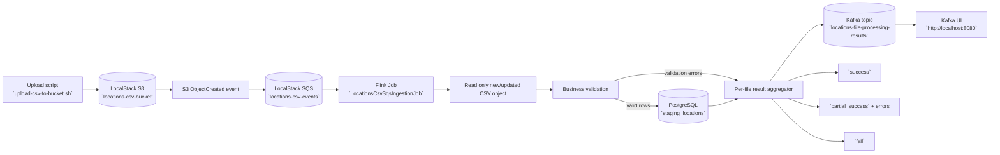

### Locations CSV with SQS-triggered S3 processing

This module processes CSV files uploaded to S3 (LocalStack) by consuming S3 object-created notifications through SQS.

### Solution diagram



### What is included

- Flink job: `io.github.jlmc.flink.locationscsv.LocationsCsvSqsIngestionJob`
- Local infra: PostgreSQL + LocalStack (`S3` and `SQS`) in `docker-compose.yaml`
- AWS bootstrap script: `scripts/init-aws.sh`
- Upload helper script: `scripts/upload-csv-to-bucket.sh`

### Start infrastructure

```bash
cd real-world-examples/locations-csv-sqs-events
docker compose up -d postgres localstack
docker compose up aws_setup postgres_setup
```

### Upload a CSV file (triggers SQS event)

```bash
./scripts/upload-csv-to-bucket.sh ./input/locations-test.csv
```

### Run Flink job from IDE or Maven

Set (optional) env vars:

- `AWS_ENDPOINT` (default: `http://localhost:4566`)
- `AWS_REGION` (default: `us-east-1`)
- `AWS_ACCESS_KEY_ID` (default: `test`)
- `AWS_SECRET_ACCESS_KEY` (default: `test`)
- `SQS_QUEUE_URL` (default: `http://localhost:4566/000000000000/locations-csv-events`)
- `JDBC_URL` (default: `jdbc:postgresql://localhost:5433/locations_db`)
- `JDBC_USER` (default: `locations_user`)
- `JDBC_PASSWORD` (default: `locations_password`)

Then run the main class:

`io.github.jlmc.flink.locationscsv.LocationsCsvSqsIngestionJob`
