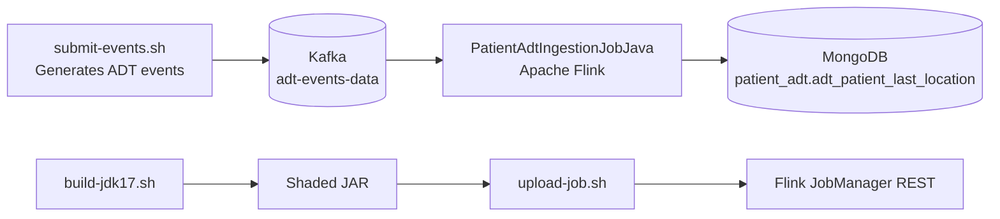

# patient-adt-processing-job-maven

Patient ADT stream processing example using `Apache Flink` + `Kafka` + `MongoDB`.

## Use case

This job consumes ADT events (`A01`, `A02`, `A21`, `A22`, `A03`) from Kafka and keeps the latest valid location per patient.

Pipeline summary:
- Reads keyed events from topic `adt-events-data`.
- Extracts `AdtEvent` from Kafka key/value.
- Groups by `accountId_patientId`.
- Resolves latest valid patient location with `MapState` + TTL.
- Upserts the resolved state into MongoDB collection `adt_patient_last_location`.

## Architecture diagram



## Infrastructure services (what each one does)

- `jobmanager` (Flink): coordinates the Flink cluster, schedules tasks, exposes the Web UI/REST API (`:8081`), and exposes Prometheus metrics (`:9249` inside the Docker network).
- `taskmanager` (Flink): executes stream operators (`map`, `keyBy`, `process`, `sink`) and also exposes Prometheus metrics (`:9249` inside the Docker network).
- `kafka`: event broker that stores ADT events in topic `adt-events-data` and serves as pipeline input.
- `kafka-init`: one-shot init container that creates required Kafka topics (`adt-events-data`, `result-data`) at startup.
- `kafka-ui`: web UI to inspect Kafka cluster metadata, topics, and messages.
- `mongodb`: persistence layer where the job upserts `patient_adt.adt_patient_last_location`.
- `minio`: S3-compatible object storage used by Flink/S3 integrations in this local stack.
- `minio_setup`: one-shot init container that creates the bucket `flink-s3-bucket` in MinIO.
- `prometheus`: scrapes Flink metrics from `jobmanager` and `taskmanager`.
- `loki`: centralized log storage backend.
- `promtail`: collects Docker logs (notably `jobmanager` and `taskmanager`) and sends them to Loki.
- `grafana`: centralized UI for both metrics (Prometheus datasource) and logs (Loki datasource), including the provisioned dashboard.

## Infrastructure network diagram

```mermaid
flowchart LR
    subgraph HOST[Local host]
        S[Scripts\nsubmit-events.sh / upload-job.sh]
        B[Browser]
    end

    subgraph NET[Docker network: adt-demo]
        K[(Kafka)]
        KI[kafka-init]
        KUI[Kafka UI]
        JM[Flink JobManager]
        TM[Flink TaskManager]
        MDB[(MongoDB)]
        MIN[(MinIO)]
        MIS[minio_setup]
        PR[Prometheus]
        LO[Loki]
        PT[Promtail]
        GF[Grafana]
    end

    S -->|produce ADT events| K
    S -->|submit job (REST)| JM
    K -->|source| TM
    TM -->|upsert last location| MDB
    JM <-->|cluster control| TM
    JM -. checkpoints/state backend .-> MIN
    TM -. checkpoints/state backend .-> MIN

    KI -->|create topics| K
    MIS -->|create bucket| MIN

    PR -->|scrape :9249| JM
    PR -->|scrape :9249| TM
    PT -->|collect docker logs| JM
    PT -->|collect docker logs| TM
    PT -->|push logs| LO
    GF -->|query metrics| PR
    GF -->|query logs| LO

    B -->|:8081| JM
    B -->|:8085| KUI
    B -->|:9001| MIN
    B -->|:3000| GF
    B -->|:9090| PR
```

## How to run

Run from:

`real-world-examples/patient-adt-processing-job-maven`

1. Start infrastructure

```bash
docker compose up -d
```

2. Build job JAR (JDK 17)

```bash
./build-jdk17.sh
```

3. Upload and start Flink job

```bash
./upload-job.sh
```

4. Submit sample ADT events to Kafka

```bash
./submit-events.sh
```

## Service web interfaces

- Flink JobManager UI: `http://localhost:8081`
- Kafka UI: `http://localhost:8085`
- MinIO Console: `http://localhost:9001`
- Grafana (centralized logs + metrics): `http://localhost:3000` (user: `admin`, password: `admin`)
- Prometheus: `http://localhost:9090`
- Loki API: `http://localhost:3100`

Services without native web UI in this stack:
- Kafka broker: no web UI (`localhost:9092`)
- MongoDB: no web UI (`localhost:27017`)
- Flink TaskManager: no dedicated web UI (managed via JobManager UI)

## Centralized observability (Flink logs + metrics)

This stack now includes a centralized observability layer:
- `Prometheus` scrapes Flink metrics from JobManager and TaskManager.
- `Loki` stores container logs.
- `Promtail` collects Docker logs from Flink containers (`jobmanager`, `taskmanager`) and ships them to Loki.
- `Grafana` is the single UI to query both metrics and logs.

Quick usage in Grafana:
1. Open `http://localhost:3000` and login with `admin` / `admin`.
2. Open the auto-provisioned dashboard: **Dashboards -> Flink -> Flink ADT Observability**.
   - It includes Flink target health (`jobmanager`, `taskmanager`), running jobs, and centralized logs.
3. Metrics:
   - Go to **Explore** and select datasource `Prometheus`.
   - Example query: `flink_jobmanager_numRunningJobs`.
4. Logs:
   - Go to **Explore** and select datasource `Loki`.
   - Example query: `{container=~"jobmanager|taskmanager"}`.

## Portuguese version

See `README.pt.md`.
