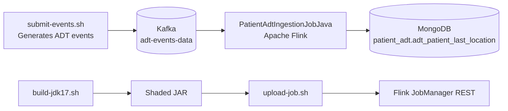

# patient-adt-processing-job-maven

Patient ADT stream processing example using `Apache Flink` + `Kafka` + `MongoDB`.

## Use case

This job consumes ADT events (`A01`, `A02`, `A21`, `A22`, `A03`) from Kafka and keeps the latest valid location per patient.

Pipeline summary:
- Reads keyed events from topic `adt-events-data`.
- Extracts `AdtEvent` from Kafka key/value.
- Groups by `accountId_patientId`.
- Resolves latest valid patient location with `MapState` + TTL.
- Upserts the resolved state into MongoDB collection `adt_patient_last_location`.

## Architecture diagram



## How to run

Run from:

`real-world-examples/patient-adt-processing-job-maven`

1. Start infrastructure

```bash
docker compose up -d
```

2. Build job JAR (JDK 17)

```bash
./build-jdk17.sh
```

3. Upload and start Flink job

```bash
./upload-job.sh
```

4. Submit sample ADT events to Kafka

```bash
./submit-events.sh
```

## Service web interfaces

- Flink JobManager UI: `http://localhost:8081`
- Kafka UI: `http://localhost:8085`
- MinIO Console: `http://localhost:9001`

Services without native web UI in this stack:
- Kafka broker: no web UI (`localhost:9092`)
- MongoDB: no web UI (`localhost:27017`)
- Flink TaskManager: no dedicated web UI (managed via JobManager UI)

## Portuguese version

See `README.pt.md`.
