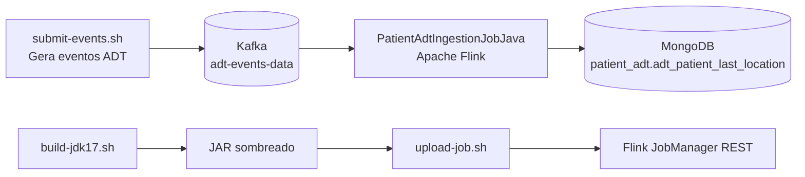

# patient-adt-processing-job-maven

Exemplo de processamento de eventos ADT de pacientes com `Apache Flink` + `Kafka` + `MongoDB`.

## Caso de uso

Este job consome eventos ADT (`A01`, `A02`, `A21`, `A22`, `A03`) do Kafka e mantém a última localização válida por paciente.

Resumo do pipeline:
- Lê eventos com chave no tópico `adt-events-data`.
- Extrai `AdtEvent` a partir da mensagem Kafka (chave/valor).
- Agrupa por `accountId_patientId`.
- Resolve a última localização válida com `MapState` + TTL.
- Faz `upsert` do estado resolvido na coleção MongoDB `adt_patient_last_location`.

## Diagrama de arquitetura



## Como correr

Executar dentro de:

`real-world-examples/patient-adt-processing-job-maven`

1. Subir infraestrutura

```bash
docker compose up -d
```

2. Build do JAR do job (JDK 17)

```bash
./build-jdk17.sh
```

3. Upload e arranque do job no Flink

```bash
./upload-job.sh
```

4. Enviar eventos ADT de exemplo para o Kafka

```bash
./submit-events.sh
```

## URLs das interfaces web dos serviços

- Flink JobManager UI: `http://localhost:8081`
- Kafka UI: `http://localhost:8085`
- MinIO Console: `http://localhost:9001`

Serviços sem interface web nativa nesta stack:
- Kafka broker: sem web UI (`localhost:9092`)
- MongoDB: sem web UI (`localhost:27017`)
- Flink TaskManager: sem web UI dedicada (gerido via JobManager UI)

## English version

Ver `README.md`.
