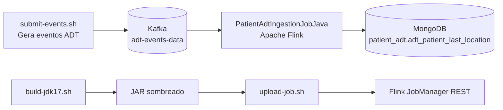
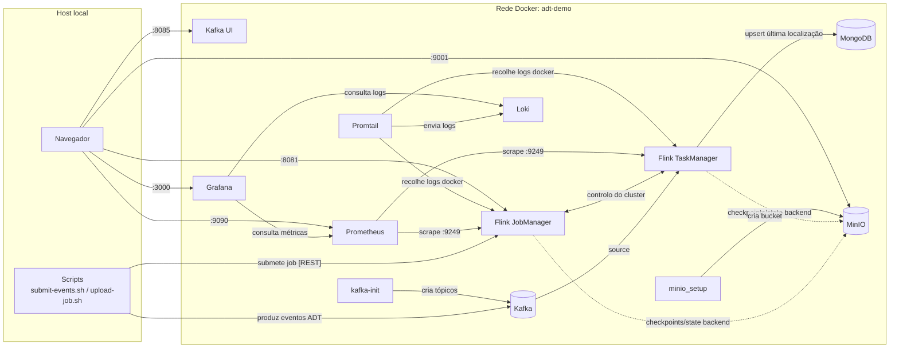

# patient-adt-processing-job-maven

Exemplo de processamento de eventos ADT de pacientes com `Apache Flink` + `Kafka` + `MongoDB`.

## Caso de uso

Este job consome eventos ADT (`A01`, `A02`, `A21`, `A22`, `A03`) do Kafka e mantém a última localização válida por paciente.

Resumo do pipeline:
- Lê eventos com chave no tópico `adt-events-data`.
- Extrai `AdtEvent` a partir da mensagem Kafka (chave/valor).
- Agrupa por `accountId_patientId`.
- Resolve a última localização válida com `MapState` + TTL.
- Faz `upsert` do estado resolvido na coleção MongoDB `adt_patient_last_location`.

## Diagrama de arquitetura



## Serviços de infraestrutura (o que faz cada um)

- `jobmanager` (Flink): coordena o cluster Flink, agenda tarefas, expõe a Web UI/API REST (`:8081`) e expõe métricas Prometheus (`:9249` dentro da rede Docker).
- `taskmanager` (Flink): executa os operadores do stream (`map`, `keyBy`, `process`, `sink`) e também expõe métricas Prometheus (`:9249` dentro da rede Docker).
- `kafka`: broker de eventos que armazena os eventos ADT no tópico `adt-events-data` e serve como entrada do pipeline.
- `kafka-init`: container de inicialização (one-shot) que cria os tópicos necessários (`adt-events-data`, `result-data`) no arranque.
- `kafka-ui`: interface web para inspecionar metadados do cluster Kafka, tópicos e mensagens.
- `mongodb`: camada de persistência onde o job faz `upsert` em `patient_adt.adt_patient_last_location`.
- `minio`: storage compatível com S3 usado nas integrações Flink/S3 nesta stack local.
- `minio_setup`: container de inicialização (one-shot) que cria o bucket `flink-s3-bucket` no MinIO.
- `prometheus`: recolhe (scrape) métricas Flink a partir de `jobmanager` e `taskmanager`.
- `loki`: backend centralizado de armazenamento de logs.
- `promtail`: recolhe logs Docker (principalmente `jobmanager` e `taskmanager`) e envia para o Loki.
- `grafana`: interface centralizada para métricas (datasource Prometheus) e logs (datasource Loki), incluindo o dashboard provisionado.

## Diagrama de rede da infraestrutura



## Como correr

Executar dentro de:

`real-world-examples/patient-adt-processing-job-maven`

1. Subir infraestrutura

```bash
docker compose up -d
```

2. Build do JAR do job (JDK 17)

```bash
./build-jdk17.sh
```

3. Upload e arranque do job no Flink

```bash
./upload-job.sh
```

4. Enviar eventos ADT de exemplo para o Kafka

```bash
./submit-events.sh
```

## URLs das interfaces web dos serviços

- Flink JobManager UI: `http://localhost:8081`
- Kafka UI: `http://localhost:8085`
- MinIO Console: `http://localhost:9001`
- Grafana (logs + métricas centralizados): `http://localhost:3000` (user: `admin`, password: `admin`)
- Prometheus: `http://localhost:9090`
- Loki API: `http://localhost:3100`

Serviços sem interface web nativa nesta stack:
- Kafka broker: sem web UI (`localhost:9092`)
- MongoDB: sem web UI (`localhost:27017`)
- Flink TaskManager: sem web UI dedicada (gerido via JobManager UI)

## Observabilidade centralizada (logs + métricas do Flink)

Esta stack inclui agora uma camada de observabilidade centralizada:
- `Prometheus` recolhe métricas do Flink (JobManager e TaskManager).
- `Loki` armazena os logs dos containers.
- `Promtail` recolhe logs Docker dos containers do Flink (`jobmanager`, `taskmanager`) e envia para o Loki.
- `Grafana` é a UI única para consultar métricas e logs.

Uso rápido no Grafana:
1. Abrir `http://localhost:3000` e autenticar com `admin` / `admin`.
2. Abrir o dashboard provisionado automaticamente: **Dashboards -> Flink -> Flink ADT Observability**.
   - Inclui estado dos targets Flink (`jobmanager`, `taskmanager`), jobs em execução e logs centralizados.
3. Métricas:
   - Ir a **Explore** e selecionar datasource `Prometheus`.
   - Exemplo de query: `flink_jobmanager_numRunningJobs`.
4. Logs:
   - Ir a **Explore** e selecionar datasource `Loki`.
   - Exemplo de query: `{container=~"jobmanager|taskmanager"}`.

## English version

Ver `README.md`.
